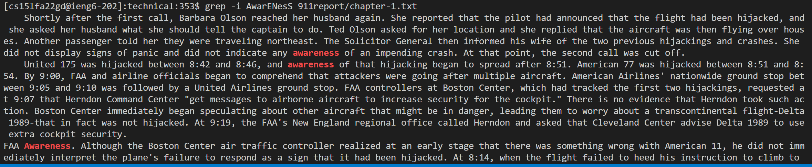

Arvin Zhang

# Lab Report 3 - Researching Commands

## Grep Command

Overview: The grep command allows the user to locate specific lines with certain strings of characters inside specific files.

### 1) grep -i

The -i command line option tells the grep command to be case insensitive and ignore all cases.

#### Example 1: Single Directory

Command:
`grep -i AwarENesS 911report/chapter-1.txt`

When ran in the working directory of ./technical, this command will find all of the instances of the term "awareness" in 911report/chapter-1.txt while ignoring cases.

Output:

Analysis:
As seen in the output above, when running grep -i with a mixed cased string of characters, "AwarENesS," the terminal finds all cases of "AwarENesS." The first two "awareness" has no capital letters, but the last one in the image has a capital "A." Each term found is also highlighted for the user to see and its surrounding words are also printed out. This command line option is useful because it allows the user to search for all instances of a term regardless of cases instead of searching for each and every possible case combination.

### Example 2: Multiple Files

`grep -i preSIDent 911report/chapter-1.txt 911report/chapter-2.txt 911report/chapter-3.txt`

By adding multiple directories after the searching term, the user is able to search through more than one file.

Output:

Analysis:
As seen in the output above, the output contains text from chapter 1, chapter 2, and chapter 3 within the directory /911report. Furthermore, each search also ignored the capital letters as the input search term was 'preSIDent' but grep found instances of both 'President' and 'president.' Being able to search multiple files while ignoring cases is important for the user because it makes it efficient to process data or search for a specific key term.

### Example 3: Combination with Numeric Numbers

`grep -i anX5 biomed/*.txt`

Although adding numerical values to the input, the user is still able to search for key terms.

Output:

Analysis:
As seen in the output above, the output still successfully searches for the key term 'anx5' while ignoring capitalization. Since there is no 'lowercase' or 'uppercase' '5,' grep -i simply treates it as a normal character while searching. We are also able to use \*.txt in the file path to search all of the .txt files in a directory. It is important for grep -i to be able to process numerical values since not all characters of a text are from the alphabet.

## 2) grep -c

The -c command line option tells the grep command to override the normal output of printing the instances of the input and instead counts the instances of the input in each file.

### Example 1: Multiple Directories

`grep -c health plos/*.txt`

This command is searching for the number of instances of the word "health" within all .txt files of /plos directory.

Output:

Analysis:
As seen in the output above, grep -c lists each file it searches through along with a numerical value indicating the number of instances the input was found in that file. For example, in plos/pmed.0010010.txt, 7 instances of the word "health" was found. This is useful for the user because it allows the user to easily get the number of times a keyword appears in a txt without visually seeing each instance, which can be unecessary and tedious.

### Example 2: Multiple inputs

`grep -c 'with\|the' */*.txt`

This command counts all first layer directories in /technical and their .txt files for instances of the terms "with" and "the."

Output:

Analysis:
As seen in the output above, the output contains multiple files from multiple directories (ie. biomed, plos). The output also displays the number of instances of "with" and "the" within the file. Being able to allow the user to input and search for multiple terms is important because it give the user more flexibility in order to complete searching tasks more effectively and efficiently.

### Example 3: Patterns with Space

`grep -c "with a" plos/*.txt`

The command searches for the pattern "with a". Notice how to space is included in the pattern.

Output:

Analysis:
As seen in the output above, the output displays a numerical value for each file, counting the number of times "with a" appeared. Specifically in the first screenshot, it shown that plos/pmed.0020258.txt contains one instance of "with a". This is proven true in the second screenshot with a simple grep command. It is important for the user to be able to search for strings with spaces in them because it provides more flexibility as then they would be able to search and count for phrases or sentences.

## 3) grep -L

The -L command line option tells the grep command to override the normal output of printing the instances of the input and instead prints all files without instances of the input.

### Example 1: Excluding String

`grep -L "with a" */*.txt`

This command finds all first layer directories in /technical and their .txt files for files without the string "with a".

Output:

As seen in the first output screenshot above, the output only outputs files and their paths with no numerical value or text. These files that are outputed are files that do not contain the input "with a". As seen in the second screenshot above, which was an output for `grep -c "with a" plos/*.txt`, file plos/pmed.0020278.txt contains 0 instances of "with a", and as a result, it is outputed in the first screenshot. It is important for the user to be able to search for files that do not contain a specific string because it allows them to filter the results more effectively for processing purposes.

### Example 2: Comparing Two Files

`grep -L sequence biomed/rr166.txt biomed/rr167.txt`

The command searches each file for instances of the string "sequence" and outputs files without it.

Output:

As seen in the first output screenshot, the command is processing two files, biomed/rr166.txt and biomed/rr167.txt and outputting the file without the string "sequence" which is biomed/rr166.txt. As seen in the second screenshot, which was the output for `grep -c sequence biomed/*.txt` there are two instances of "sequence" in biomed/rr167.txt with zero instances in biomed/rr166.txt, thus proving the command worked. This is a useful example as it allows users to effectively and efficiently compare two different files without manueling reading through each file.

### Example 3: Multiple Inputs

`grep -L "account\|problems\|legal\|States" government/*/*.txt`

The command searches for all files within the government directory that do not contain instances of "account", "problems", "legal", or "States".

Output:

As seen in the output above, there are only a few files that do not contain instances of "account", "problems", "legal", or "States". If a file contains atleast one of the strings mentioned before, it will not be outputted. It is important that the user is able to enter multiple inputs at once to further filter their searching result.
