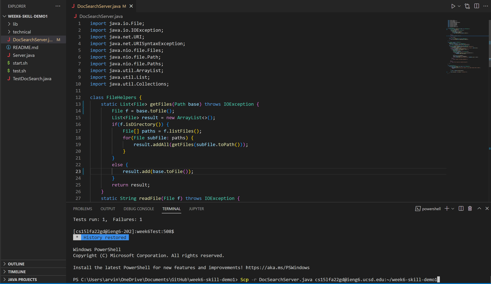

Arvin Zhang

# Lab Report 4 - Vim

# Part 1

TASK: In DocSearchServer.java, change the name of the start parameter of getFiles, and all of its uses, to instead be called base.

Commands (Assuming we are already in week6-skill-demo1 directory):

```
vim<space><shift>D<tab><Enter>

:%s/start/base<Enter>

:wq<Enter>
```

Total Key Strokes: 28

### Breakdown:

```
vim<space><shift>D
```

Enter the command vim along with the first letter of the desired file. Then press tab to automatically fill out the file name. Press enter to run the command. This enters vim mode and allows the user to edit the document with vim.


```
:%s/start/base<Enter>

```

Here we run the subsitution command across the entire file to replace all instances of start with base. The % tells the subsitution command that we are searching the entire file. The s indicates we are using the subsitution command. The first following the / is the word we are trying to replace (in this case is "start"). The second keyword following / is the word with are replacing with (in this case is "base"). After hitting enter to run the command, vim tells us how many instances were found and replaced (see images below).


```
:wq<Enter>
```

Lastly, :wq is used to exit the vim window and write the changes that were made to the file.

# Part 2

VS Code Method:


Total Time: 1 minute 18 seconds

Difficulties:

- Was a hassle entering remote from local
- Had to enter longer commands to scp into remote.

Remote Vim Method:


Total Time: 30 seconds

Difficulties:

- Not as familiar with commands and keys

Style Preference:

Although I am still unfamiliar with vim commands, I prefer using vim because of its simplicity and easy of use. With vim, I do not have to move between local and remote as all the commands can be run on remote. With VS code however, I have to edit it on local and then scp to remote and then move to remote. Thus, I would prefer using vim command and staying on remote when working on a program that I was running remotely.

Decision Factors:

Some project or task facts that will influence my decision on what method I will use will be the difficulty of the task, how monotonous the task is, and wether it is remote or not. If the task is more difficult, I would choose to use VS Code since I am more familiar with it. If the task it monotonous, I will choose to use vim since its commands such as subsitution are easy to use for a large amount of code. If the task is remote, I will also choose to use vim since with vim, I do not need to jump between local and remote.
