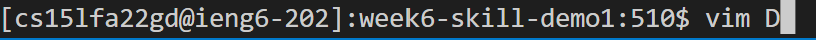
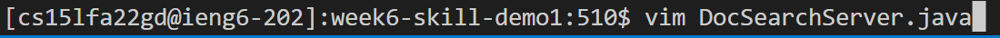
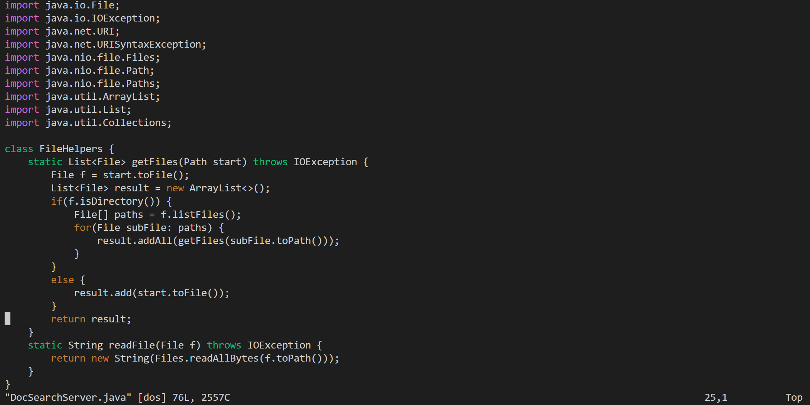
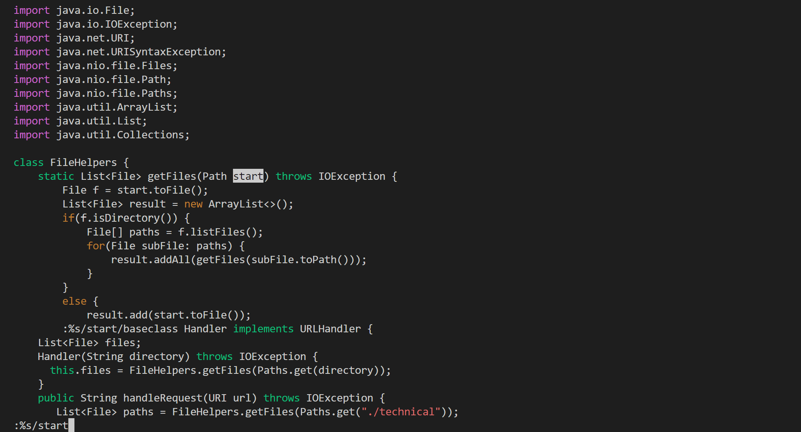
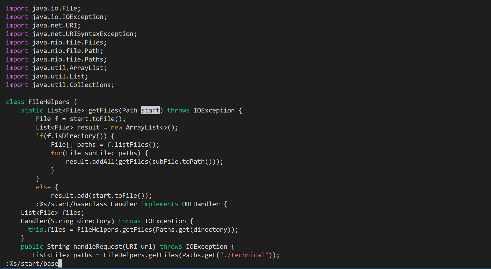
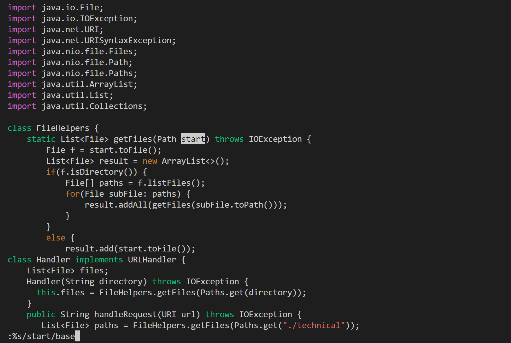
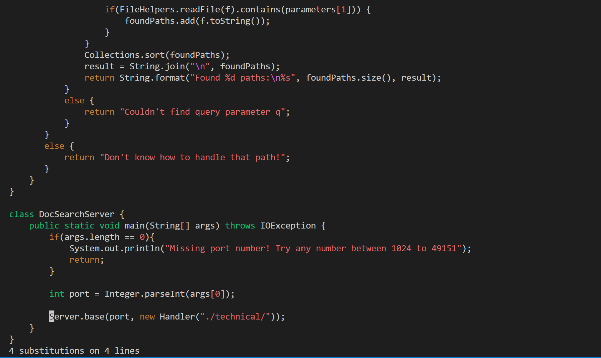

Arvin Zhang

# Lab Report 4 - Vim

TASK: In DocSearchServer.java, change the name of the start parameter of getFiles, and all of its uses, to instead be called base.

Commands (Assuming we are already in week6-skill-demo1 directory):

```
vim<space><shift>D<tab><Enter>

:%s/start/base<Enter>

:wq<Enter>
```

Total Key Strokes: 28

### Breakdown:

```
vim<space><shift>D
```

Enter the command vim along with the first letter of the desired file. Then press tab to automatically fill out the file name. Press enter to run the command. This enters vim mode and allows the user to edit the document with vim.





```
:%s/start/base<Enter>

```

Here we run the subsitution command across the entire file to replace all instances of start with base. The % tells the subsitution command that we are searching the entire file. The s indicates we are using the subsitution command. The first following the / is the word we are trying to replace (in this case is "start"). The second keyword following / is the word with are replacing with (in this case is "base").





