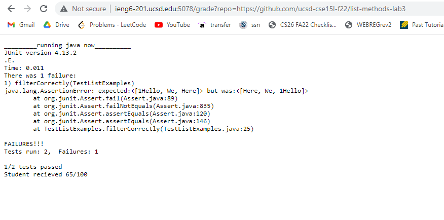
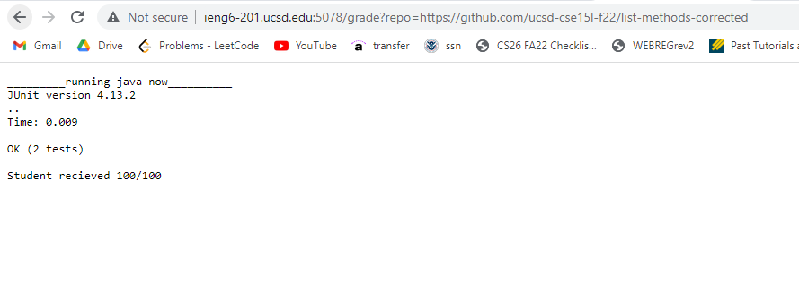
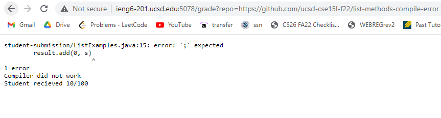

Arvin Zhang
(Collaborated with Dima Demler in lab)

# Lab Report 5 - Autograder

# Code Block:

Code from grade.sh

```
# Inspired by code from this the repository https://github.com/kNelakonda/list-examples-grader/blob/main/grade.sh
FSCORE=0
MAXSCORE=100

function score_message() {
    printf "Student recieved $1/$2 \n"

    exit 0
}

rm -rf student-submission

git clone $1 student-submission

echo 'Finished cloning'

cp TestListExamples.java ./student-submission/


if [ -f ./student-submission/ListExamples.java ]; then
    echo found
    FSCORE=$((FSCORE + 10))
else
    echo not found java file
    score_message $FSCORE $MAXSCORE
fi

javac -cp .:lib/hamcrest-core-1.3.jar:lib/junit-4.13.2.jar student-submission/TestListExamples.java student-submission/ListExamples.java

if [[ $? -ne 0 ]]; then
    printf "Compiler did not work\n"
    score_message $FSCORE $MAXSCORE
fi

FSCORE=$((FSCORE + 20))

cd student-submission/

printf "_________running java now__________\n"

java -cp .:../lib/hamcrest-core-1.3.jar:../lib/junit-4.13.2.jar org.junit.runner.JUnitCore TestListExamples >output.txt

if [[ $? -eq 0 ]]; then
    cat output.txt
    FSCORE=$((FSCORE + 70))
else
    cat output.txt
    t=$(grep -i "Tests run" output.txt)
    tests=$(echo $t | cut -d ' ' -f 3 | cut -d ',' -f 1)
    failed=$(echo $t | cut -d ' ' -f 5)

    echo $((tests - failed))/$tests tests passed

    FSCORE=$((FSCORE + 35 * (tests - failed)))

fi

score_message $FSCORE $MAXSCORE
```

# Example 1



# Example 2



# Example 3



# Tracing Example 1

In example one, I tested grade.sh on this repository: https://github.com/ucsd-cse15l-f22/list-methods-lab3

## Lines 1-4

```
FSCORE=0
MAXSCORE=100
```

Defines variables FSCORE and MAXSCORE which is updated later on in the program to calculate the scores of the student submission with each test case.
The standard output and standard error are empty. Both lines return 0 since the variables were sucessfully defined.

## Lines 5-9

```
function score_message() {
    printf "Student recieved $1/$2 \n"
    exit 0
}
```

Defines the function for score_message() in order to print the student's score and end the bash early with exit 0.
The print statement returns "Student recieved $1/$2 \n" to the standard output. Both lines in the function return 0 as they successfully run.

## Line 11

```
rm -rf student-submission
```

This line removes the current student-submission directory in order to test the new student submission. There is no standard output and standard error in this line. It returns 0 since it successfully runs.

## Line 13

```
git clone $1 student-submission
```

This line clones the new student submission to prepare for testing. There is no standard output but the standard error when cloning is "Cloning into 'student-submission'..." This line returns 0 since is successfully runs.

## Line 15

```
echo 'Finished cloning'
```

This line outputs the line 'Finished cloning' to the standard output to let the user know cloning finished. There is no standard error and the line returns 0 since it successfully runs.

## Line 17

```
cp TestListExamples.java ./student-submission/
```

This line copies the TestListExamples.java file into the new student-submission directory. There is no standard output or standard error. The line returns 0 sicne it successfully runs.

## Line 20-26

```
if [ -f ./student-submission/ListExamples.java ]; then
    echo found
    FSCORE=$((FSCORE + 10))
else
    echo not found java file
    score_message $FSCORE $MAXSCORE
fi
```

The if statement tests if ListExamples.java exists. In example 1 this line returns true since the file is included. Thus example 1 enters the first part of the if statement rather than the else section. The echo line outputs "found" to the standard output. There is no standard error for the echo line. The echo line returns 0 since it successfully runs. Then the variable FSCORE is updated. This line has no standard output or standard error and also returns 0 since it runs successfully. The else statement does not run.

## Line 28

```
javac -cp .:lib/hamcrest-core-1.3.jar:lib/junit-4.13.2.jar student-submission/TestListExamples.java student-submission/ListExamples.java
```

This line runs the javac command on junit, hamcrest core, TestListExamples, and ListExamples. There are no standard outputs or errors. In example 1 this line returns 0 since it successfully runs.

## Lines 30-33

```
if [[ $? -ne 0 ]]; then
    printf "Compiler did not work\n"
    score_message $FSCORE $MAXSCORE
fi
```

This if statement does not run since it checks if the last return was not 0. However, line 28 returns 0 in example one since it successfully runs. There are no standard outputs or errors. The if statement returns 0 since it successfully runs.

## Line 35

```
FSCORE=$((FSCORE + 20))
```

This line updates the FSCORE variable. There are no standard outputs or errors. The command returns 0 since it successfully runs.

## Line 37

```
cd student-submission/
```

This line allows the bash to enter the student-submission directory. There are no standard outputs or errors. The command returns 0 since it successfully runs.

## Line 39

```
printf "_________running java now__________\n"
```

This line outputs to standard output the line "running java now" to tell the user that java is running. There are no standard errors. The command returns 0 since it successfully runs.

## Line 41

```
java -cp .:../lib/hamcrest-core-1.3.jar:../lib/junit-4.13.2.jar org.junit.runner.JUnitCore TestListExamples >output.txt
```

This line runs Junit with TestListExamples.java and redirects its output to output.txt. The standard output is:

```
JUnit version 4.13.2
.E.
Time: 0.01
There was 1 failure:
1) filterCorrectly(TestListExamples)
java.lang.AssertionError: expected:<[1Hello, We, Here]> but was:<[Here, We, 1Hello]>
        at org.junit.Assert.fail(Assert.java:89)
        at org.junit.Assert.failNotEquals(Assert.java:835)
        at org.junit.Assert.assertEquals(Assert.java:120)
        at org.junit.Assert.assertEquals(Assert.java:146)
        at TestListExamples.filterCorrectly(TestListExamples.java:25)

FAILURES!!!
Tests run: 2,  Failures: 1
```

There are no standard errors. The line returns 1 since there was a failed test.

## Line 43-56

```
if [[ $? -eq 0 ]]; then
    cat output.txt
    FSCORE=$((FSCORE + 70))
else
    cat output.txt
    t=$(grep -i "Tests run" output.txt)
    tests=$(echo $t | cut -d ' ' -f 3 | cut -d ',' -f 1)
    failed=$(echo $t | cut -d ' ' -f 5)

    echo $((tests - failed))/$tests tests passed

    FSCORE=$((FSCORE + 35 * (tests - failed)))

fi
```

The if statement condition is false since the previous line 41 returned 1 since there was a failure in junit. Line 47 has a standard output of the contents in output.txt since it is using the cat command. There is no standard error. Lines 48-50 all assign variables and have no standaard outputs or errors. Line 52 has a standard output of "1/2 tests passed" in example 1 by using the previously assigned test and failed variables. There are no standard erros for line 52. Line 55 updates the FSCORE variable and has no standard output or errors. All commands in the else statement returns 0 since they run successfully.

## Line 58

```
score_message $FSCORE $MAXSCORE
```

This line runs the score_message function in the beginning of the base. In example 1, the print statement returns "Student recieved 65/100" to the standard output. Both lines in the function return 0 as they successfully run. The exit command ends the bash.
